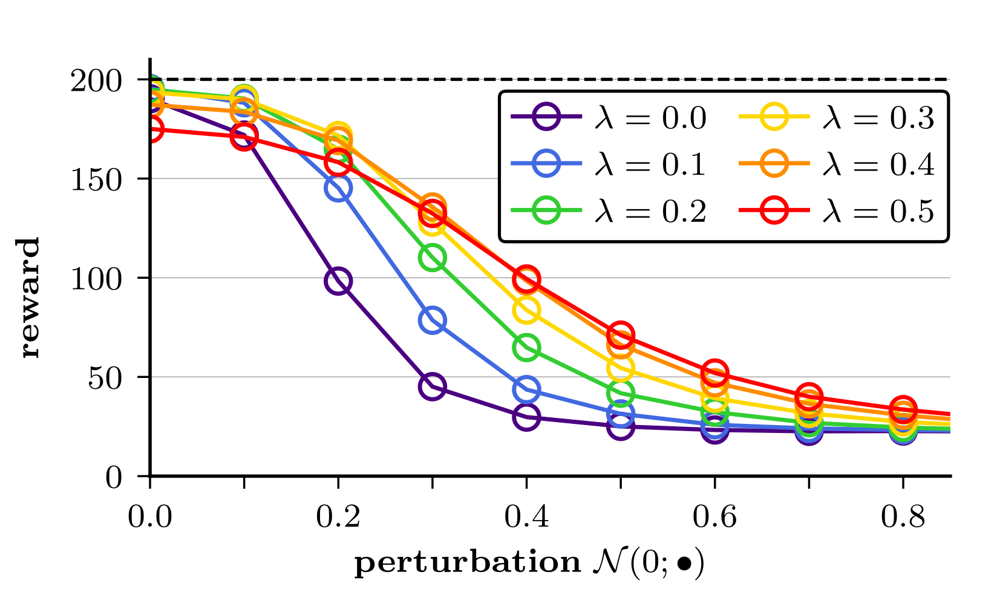

# Robustness and Generalization in Quantum Reinforcement Learning via Lipschitz Regularization

[
](https://arxiv.org/search/quant-ph?searchtype=author&query=Meyer,+N) [](https://doi.org/10.5281/zenodo.14002695)


This repo contains the code for the paper 
"Robustness and Generalization in Quantum Reinforcement Learning via Lipschitz Regularization", 
N. Meyer, J. Berberich, C. Mutschler, and D. Scherer (2024).

> Quantum machine learning leverages quantum computing to enhance accuracy and reduce model complexity compared to 
> classical approaches, promising significant advancements in various fields. Within this domain, quantum reinforcement 
> learning has garnered attention, often realized using variational quantum circuits to approximate the policy function.
> This paper addresses the robustness and generalization of quantum reinforcement learning by combining principles from 
> quantum computing and control theory. Leveraging recent results on robust quantum machine learning, we utilize 
> Lipschitz bounds to propose a regularized version of a quantum policy gradient approach, named the RegQPG algorithm. 
> We show that training with RegQPG improves the robustness and generalization of the resulting policies. Furthermore, 
> we introduce an algorithmic variant that incorporates curriculum learning, which minimizes failures during training. 
> Our findings are validated through numerical experiments, demonstrating the practical benefits of our approach.



## Setup and Installation

This codebase requires an installation of `python 3.12`, and following libraries:
- `qiskit-torch-module v1.0`, automatically installs:
  * `qiskit v1.0.0`
  * `qiskit-algorithms v0.3.0`
  * `torch v2.2.1`
  * `threadpoolctl v3.3.0`
- `gymnasium v0.29.1`

We recommend setting up a conda environment and install the required packages:

```
conda create --name ENV_NAME python=3.12
conda activate ENV_NAME
pip install -r requirements.txt
```

## Reproducing Paper Results and Plots

> **Note on Reproducibility:** <br/>
> The results in the paper are averaged over multiple runs to reduce variance -- details are denoted in the respective plots.
For training the models values for ``--seed`` from `0` to `99` were employed.  It has to be noted, that results might deviate slightly, 
as ``gymnasium.Env.reset()`` is called without fixed seeds. However, the fluctuations should be very minor when averaged
over multiple runs.

> **Downloading Pre-Computed Results:** <br/>
> Producing the full set of raw results for the paper is computationally extensive,
> i.e. we expect it to take about 950 processors hours on a typical 3.7GHz 12-core processor.<br/><br/>
> Therefore, we provide the pre-computed results: https://doi.org/10.5281/zenodo.14002695.<br/>
> Just place these in the `results` folder and run `unzip data.zip` to extract the files.

We provide a single bash script that can be used to re-produce the full data set undlerlying the results in the paper:
```angular2html
./run.sh
```
Note, that executing this script takes quite some time, and therefore it might make sense to distribute the tasks on some HPC facilities.

Once the raw results have been produced -- or downloaded -- the scripts in the `plot/` folder can be used to reproduce the paper figures. This includes:
* `plot_train.py`: **Fig. 3**, i.e. training curves for different regularization strengths
* `plot_robustness.py`: **Fig. 4**, i.e. robustness of regularized trained policies
* `plot_generalization.py`: **Fig. 5**, i.e. 2D generalization of policies trained with RegQPG algorithm
* `plot_curriculum.py`: **Fig. 6, Table 2**, i.e. 1D generalization of policies trained with CurrRegQPG algorithm

The results will be stored under their respective names as pdf files in the folder `plot/plots/XXX.pdf`.


## Training with Lipschitz Regularization

Training a model with e.g. Lipschitz regularization parameter ``0.2`` and parameter initialization seed of ``42`` 
is as straightforward as running

```angular2html
python train.py --reg=0.2 --seed=42
```

Notes on training arguments:
- If ``--seed`` is not explicitly set, a *randomized random seed* between `0` and `999999` is chosen, which also serves as 
handle for storing the results.

- For execution on Linux-based systems we recommend the standard setting of ``--threads=0``, which
uses parallelization over all available cores implemented by ``qiskit-torch-module``, leading to much faster training times.
For Windows- or MacOS-based systems it might be faster to de-activate this auto-parallelization with ``--threads=1``.

- If ``--val`` is set to a positive integer (defaults to `10`), validation will be performed over 100 environments each 
``--val`` training epochs. If this yields a performance over the success threshold -- i.e. 195 for ``CartPole-v0`` and 
475 for ``CartPole-v1`` -- early stopping will terminate the training procedure.

- Information on further possible commandline arguments can be printed by running ``python train.py --help``.

During training, information on validation and training progress will be displayed. After training terminated 
(either reaching maximum number of episodes or early stopping threshold), the trained model and additional information
on the training procedure will be stored to ``results/train/reg=0.20_42.pkl``.

## Testing Policy Robustness and Generalization

A model that has been trained as described above can be tested for robustness and generalization is the following ways:

> **Important:** For this to work, the respective ``--model`` (excluding the `.pkl` ending) has to exist in the ``results`` folder, otherwise an error will be thrown.

### Robustness regarding noisy observations

Testing the robustness of the trained policy against Gaussian-distributed noise on the observations can be run via

```angular2html
python test.py --model=reg=0.20_42 --perturbate
```

The zero-mean Gaussian noise is tested for standard deviations [0.0, 0.1, ..., 1.0] as denoted in the ``PERTURBATIONS`` 
public variable. 

> **Note:** Noise is applied after observation normalization of all dimensions to the (approximate) range [-1, 1].

The testing progress will be displayed and results will be stored to ``results/robustness/reg=0.20_42.pkl``.

### Generalization regarding initial conditions

Testing the generalization of the trained policy for different initializations of pole angle and angular velocity can be run via

```angular2html
python test.py --model=reg=0.20_42 --angle --velocity
```

The state initialization is tested for all combinations of angles `[0.1, 0.3, ..., 0.25] +-0.01`, 
and angular velocities `[-2.5, -2.0, ..., 2.5] +-0.25`, as denoted in the ``ANGLES`` and ``VELOCITIES`` 
public variables. It is possible to perform only *one-dimensional* testing by dropping the respective argument.

> **Note:** The provided initialization ranges refer to the un-normalized states, for details on possible values please 
consult the ``gymnasium`` documentation.

The testing progress will be displayed and results will be stored to ``results/generalization/reg=0.20_42.pkl``.

## Curriculum Training

Training a model on an increasing range of initial conditions while limiting the number of failures to e.g. `1000` can
be done via

```angular2html
python train_curriculum.py --reg=0.1 --seed=42 --failures=1000 --episodes 10000 --val=1
```

The routine takes the same arguments as ``train.py``, with the additional possibility to set the maximum number of failures.
Training is started with an angular velocity range of `[-0.25, 0.25]`, and incrementally enlarged to `[-0.75, 0.75]`, 
`[-1.25, 1.25]`, `[-1.75, 1.75]`, as denoted in the `VELOCITY` public variable. The range enlargement automatically
happens, as soon as validation reports results above the success thresholds (see above). Therefore, we propose to set 
``--val=1`` for this routine, and also set the number of ``--episodes`` high enough.

This procedure is executed until either 
- success on the range `[-1.75, 1.75]` has been reported, 
- the maximum number of ``--failures`` has been reached,
- the maximum number of ``--episodes`` has been reached.

Intermediate results will be stored to ``results/train/curr[RANGE]_reg=0.10_42.pkl``, the final setup to 
``results/train/curr_reg=0.10_42.pkl``.

> **Note:** It has to be taken into account, that the final model might not be very successful on the designated ranges,
> if termination happens due to reaching maximum number of failures. Therefore, we advise to test on the intermediate models.

## Acknowledgements

The codebase implementing the (non-regularized) quantum policy gradients algorithm is in parts taken and modified from 
the [Qiskit-Torch-Module GitHub Repo](https://github.com/nicomeyer96/qiskit-torch-module).

NM acknowledges support by the Bavarian Ministry of Economic Affairs, Regional Development and Energy with funds from 
the Hightech Agenda Bayern via the [project BayQS](https://www.iis.fraunhofer.de/de/profil/zukunftsinitiativen/quantentechnologien/bayqs.html).
JB acknowledges funding by Deutsche Forschungsgemeinschaft (DFG, German Research Foundation) under Germany's Excellence 
Strategy - [EXC 2075 - 390740016](https://gepris.dfg.de/gepris/projekt/390740016?context=projekt&task=showDetail&id=390740016&)
and the support by the [Stuttgart Center for Simulation Science (SimTech)](https://www.simtech.uni-stuttgart.de/sc/).

## Citation

If you use this implementation or results from the paper, please cite our work as

```
@article{meyer2024robustness,
  title={Robustness and Generalization in Quantum Reinforcement Learning via Lipschitz Regularization},
  author={Meyer, Nico and Berberich, Julian and Mutschler, Christopher and Scherer, Daniel D.},
  journal={arXiv:...},
  year={2024},
  doi={.../arXiv...}
}
```

## License

Apache 2.0 License
